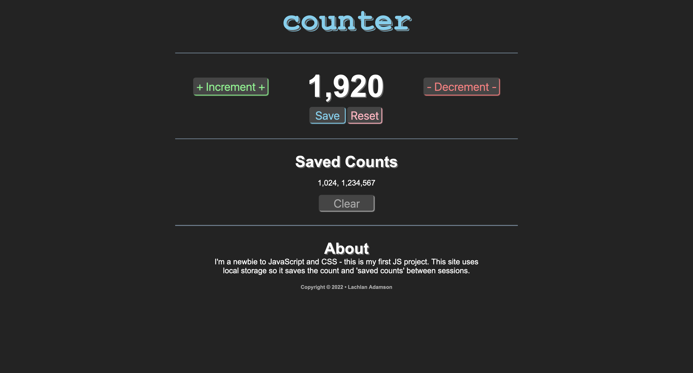

# counter-site

I'm a complete newbie with JavaScript and CSS - in fact, this is my first JavaScript project.

I'm publishing this so I can see in the future how much progress I have made since now.

## Screenshot

## License

MIT License, see `LICENSE.md` for more information.
